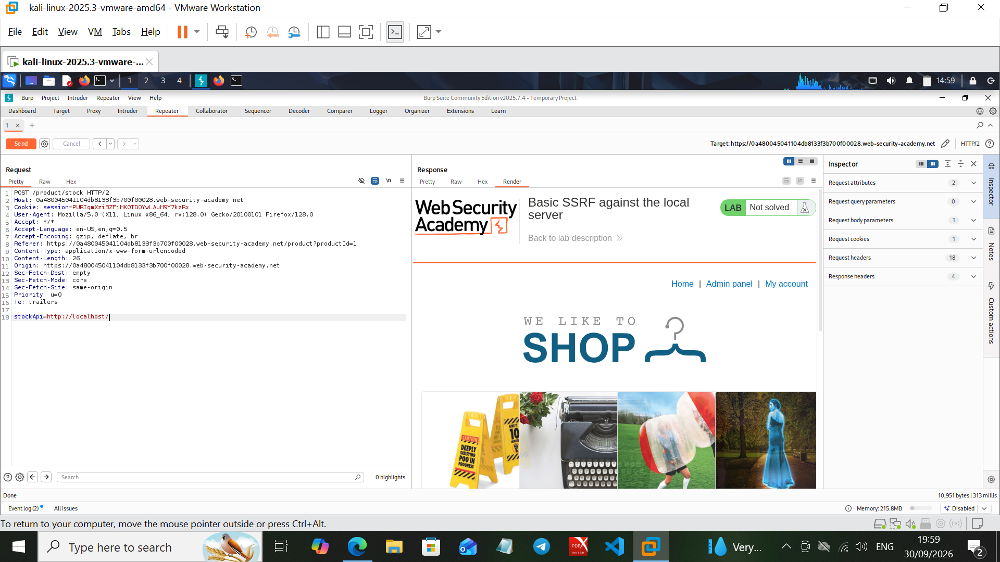
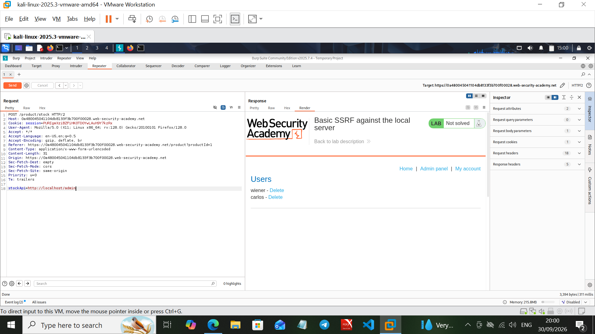
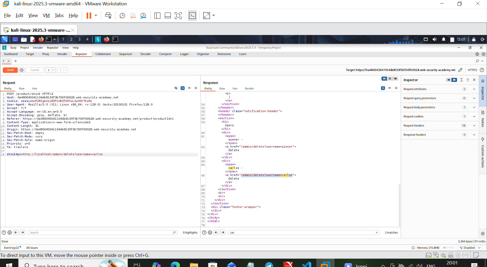
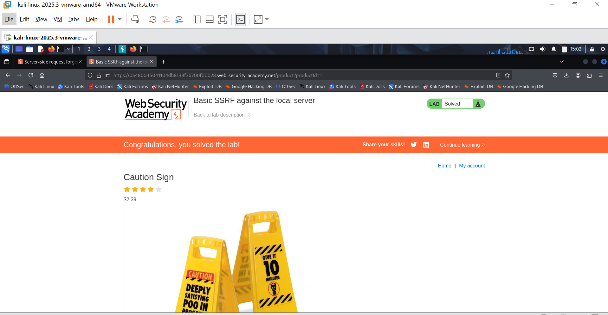

# Lab 01: Basic SSRF Against the Local Server

**Source:** PortSwigger Web Security Academy
**Category:** Server-Side Request Forgery (SSRF)
**Status:** ✅ Solved

## Objective

The target application has a "Check stock" feature that fetches stock information from an internal API by making a server-side HTTP request to a URL supplied in the `stockApi` request parameter. The goal is to abuse this behavior to reach an internal admin interface that isn't exposed on the public network, and use it to delete a user account.

## Methodology

### 1. Identify the vulnerable parameter

Intercepted the stock-check request in Burp Suite Repeater:

```
POST /product/stock HTTP/2
Host: <lab-id>.web-security-academy.net
...
stockApi=http://stock.weliketoshop.net:8080/product/stock/check?productId=1&storeId=1
```

The `stockApi` parameter is a full URL the server fetches server-side, making it a candidate for SSRF.

### 2. Probe internal access

Changed the parameter to point at `localhost` to see what the server could reach internally that an external user couldn't:

```
stockApi=http://localhost/
```



### 3. Discover the internal admin panel

Requested `/admin` on localhost. Since the request originates from the server itself, it bypasses any network-level access controls restricting the admin panel to internal IPs:

```
stockApi=http://localhost/admin
```

The response rendered the internal "Users" admin panel directly back into the application's product page.



### 4. Extract the delete action from the response source

Reviewed the raw HTML of the SSRF'd response to find the exact admin action endpoint and parameter format:

```html
<a href="/admin/delete?username=carlos">Delete</a>
```



### 5. Exploit: delete a user via SSRF

Replayed the request with the discovered admin action as the SSRF target:

```
stockApi=http://localhost/admin/delete?username=carlos
```

This caused the server to make the delete request to its own internal admin interface on the attacker's behalf, removing the `carlos` user.

### 6. Confirm

Lab marked as solved.



## Root Cause

The application trusted a user-supplied URL for a server-side fetch with no validation of scheme, host, or destination (no allowlist, no blocking of loopback/internal ranges). This let an external, unauthenticated-from-the-network-layer attacker pivot through the server to reach admin functionality that was only meant to be reachable internally.

## Remediation Notes (for client-facing reports)

- Validate and allowlist acceptable destination hosts/schemes for any server-side outbound request; deny by default.
- Block requests to loopback, link-local, and private IP ranges (127.0.0.0/8, 169.254.0.0/16, 10.0.0.0/8, 172.16.0.0/12, 192.168.0.0/16) at the application layer, not just network ACLs.
- Don't rely solely on network segmentation to protect internal admin endpoints — defense in depth matters, since SSRF defeats network-level isolation.
- Consider requiring internal services to authenticate requests even from "trusted" internal IPs.
