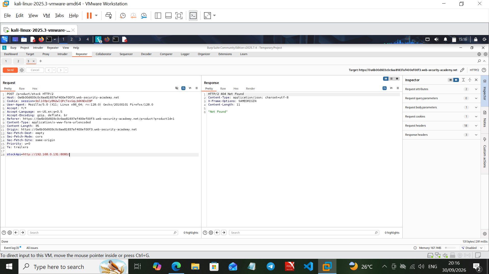
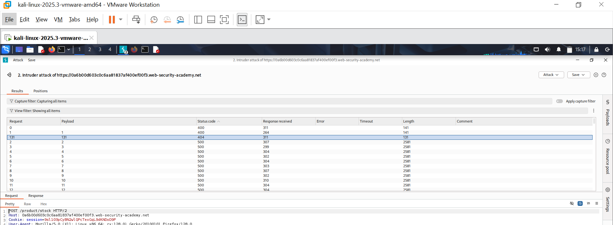
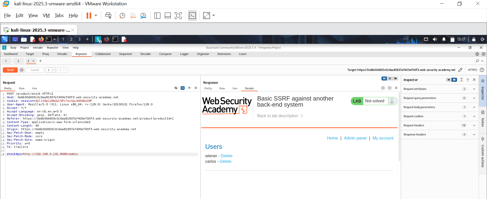
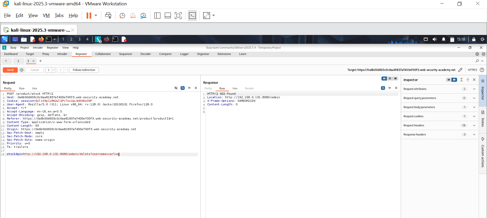
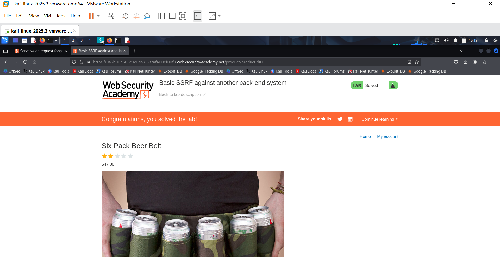

# Lab 02: Basic SSRF Against Another Back-End System

**Source:** PortSwigger Web Security Academy
**Category:** Server-Side Request Forgery (SSRF)
**Status:** ✅ Solved

## Objective

Like Lab 01, the application's "Check stock" feature fetches a URL supplied in the `stockApi` parameter. This time, the internal admin interface is not on `localhost` — it's hosted on a separate back-end system within the internal network on a non-standard port, and its address isn't given. The goal is to use the SSRF to both discover the internal host and then use it to delete a user.

## Methodology

### 1. Probe a candidate internal host

Tried a guessed internal IP on a non-standard port to see what, if anything, was listening there:

```
stockApi=http://192.168.0.131:8080/
```

Got a `404 Not Found` with a small JSON body — confirming *something* is listening on that host/port, just not at the root path.



### 2. Enumerate the internal network with Burp Intruder

Since the exact internal IP wasn't handed to us, used Burp Intruder on the `stockApi` parameter to sweep the last octet of the internal IP range (e.g. `192.168.0.1-255:8080/`), looking for a host whose response differed from the rest (most of the range returned `500` errors for non-existent hosts).

One payload stood out with a distinct status code (`404`) and response length compared to the rest of the sweep — identifying the live internal back-end host.



### 3. Confirm the admin panel on the discovered host

Pointed `stockApi` at `/admin` on the identified host:

```
stockApi=http://192.168.0.131:8080/admin
```

The response rendered the internal "Users" admin panel, confirming this was the right internal target.



### 4. Exploit: delete a user via SSRF

Submitted the delete action discovered from the admin panel's markup, same pattern as Lab 01:

```
stockApi=http://192.168.0.131:8080/admin/delete?username=carlos
```

Got back a `302 Found` redirecting to `/admin`, indicating the delete action was accepted and processed by the internal service.



### 5. Confirm

Lab marked as solved.



## Root Cause

Same underlying flaw as Lab 01 — unvalidated server-side URL fetch — but this lab demonstrates that the internal target doesn't need to be known in advance. SSRF combined with automated enumeration (Intruder sweeping an IP range) is enough to map internal infrastructure that was never meant to be externally discoverable, let alone reachable.

## Remediation Notes (for client-facing reports)

- Same allowlisting/blocklisting guidance as Lab 01 applies, but this lab underscores that relying on "the internal IP isn't publicly known" is not a security control — SSRF turns the vulnerable server into a scanner for an attacker.
- Rate-limit or alert on a high volume of distinct outbound destinations from the same server-side fetch feature in a short window, which is a strong signal of SSRF-driven internal network enumeration.
- Segment internal admin services so that even a compromised/abused application server cannot reach them directly — enforce this at the network layer in addition to application-layer validation.
