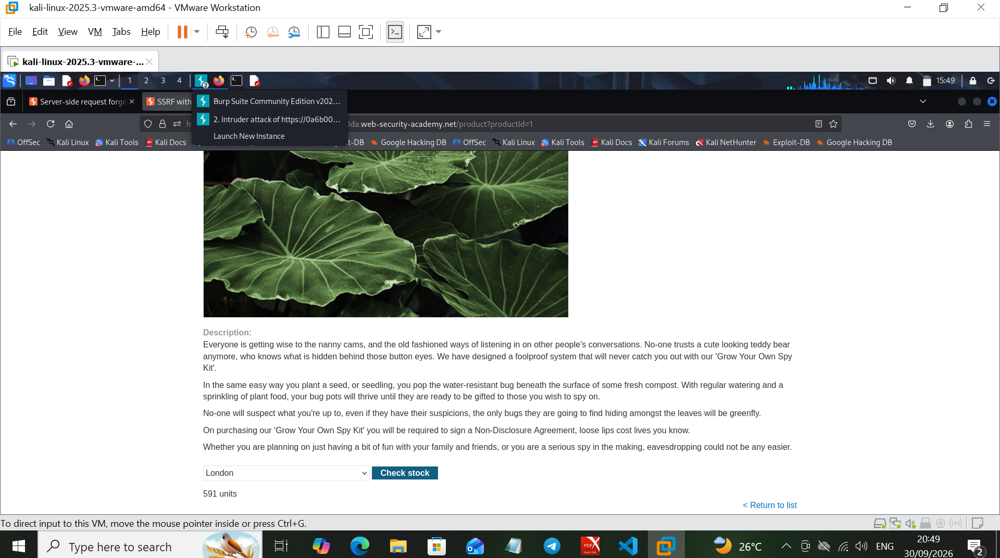
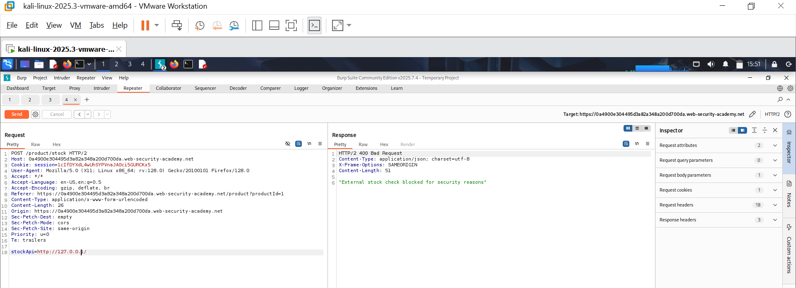
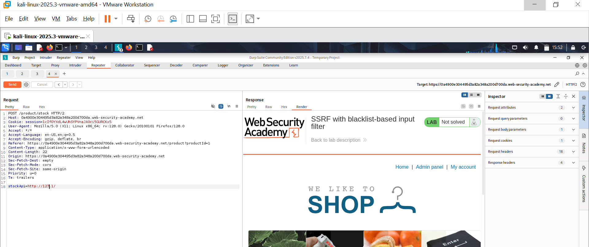
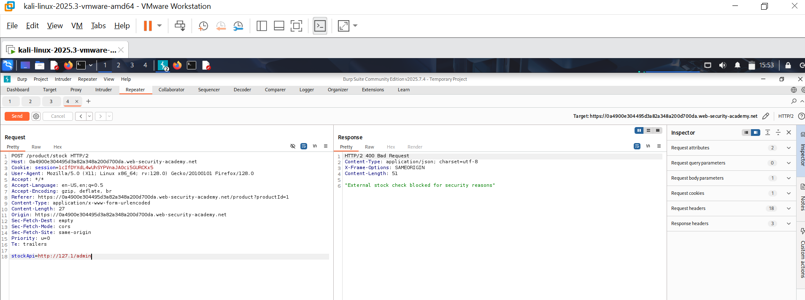
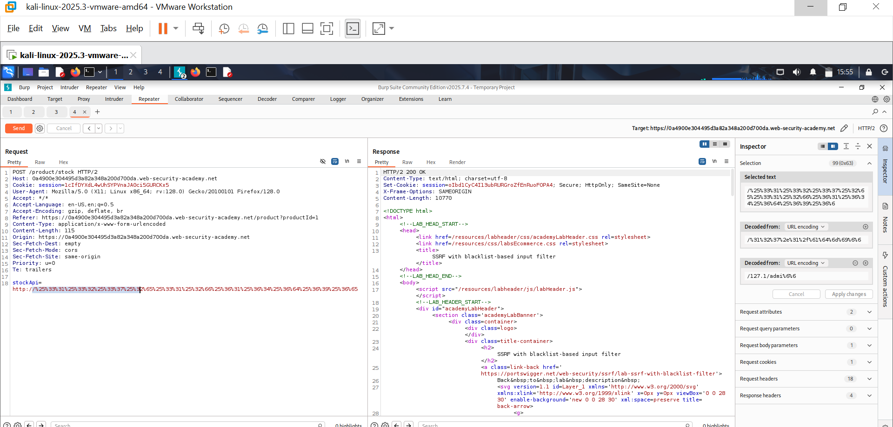
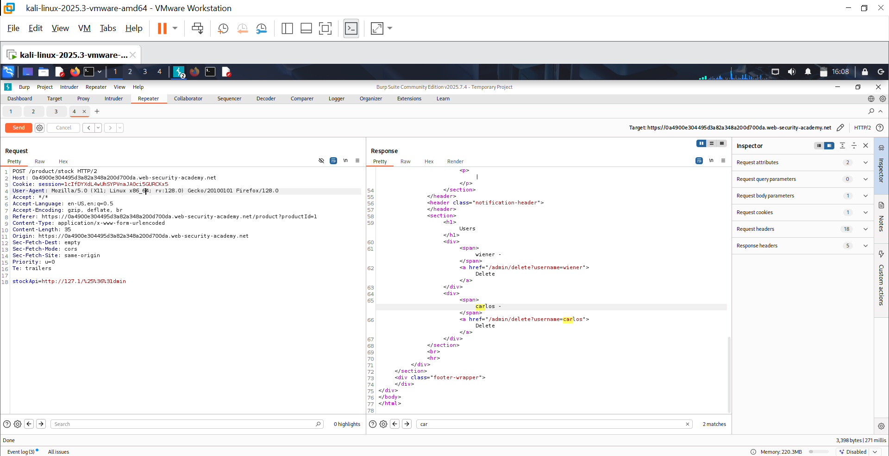
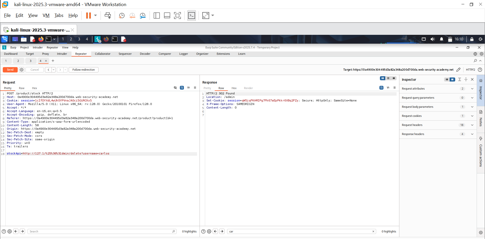
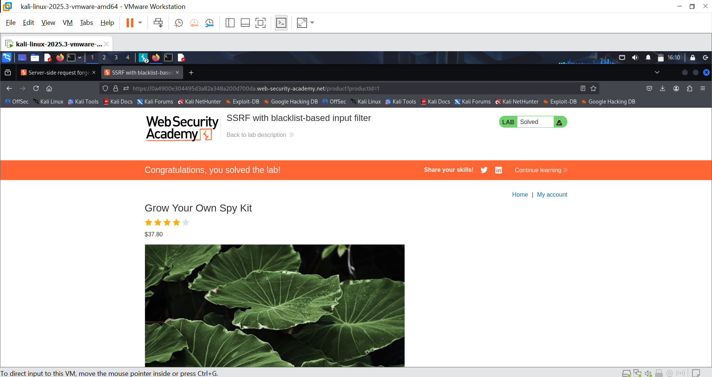

# Lab 03: SSRF with Blacklist-Based Input Filter

**Source:** PortSwigger Web Security Academy
**Category:** Server-Side Request Forgery (SSRF)
**Status:** ✅ Solved

## Objective

The target's "Check stock" feature again fetches a server-supplied URL via the `stockApi` parameter, but this time the application attempts to defend against SSRF with a blacklist filter that blocks obvious loopback addresses and the literal string `admin`. The goal is to bypass the filter and reach the internal admin panel to delete a user.

## Methodology

### 1. Baseline: the stock-check feature

Observed the normal "Check stock" feature on a product page, which makes a server-side request to look up stock for a selected location.



### 2. Confirm the blacklist blocks the obvious loopback address

```
stockApi=http://127.0.0.1/
```

Got back a `400 Bad Request` with the body `"External stock check blocked for security reasons"` — confirming a blacklist is actively filtering the supplied URL, specifically catching `127.0.0.1`.



### 3. Bypass the IP-based filter with an alternate loopback representation

```
stockApi=http://127.1/
```

`127.1` is a valid, non-obvious way of expressing `127.0.0.1` (the OS still resolves it to loopback), and it wasn't in the blacklist's pattern. The request went through normally — filter bypassed for the host portion.



### 4. Confirm the filter also blocks the "admin" keyword

```
stockApi=http://127.1/admin
```

This was blocked with the same `400` error — the blacklist also pattern-matches the literal string `admin` in the path, regardless of host.



### 5. Bypass the keyword filter with double URL encoding

Used Burp's Decoder to obfuscate the `a` in `admin` with **double URL encoding**:

- `a` → single-encode → `%61`
- `%61` → encode again → `%2561`

The blacklist check appears to decode the input only once, so it sees `%61dmin` (not recognized as "admin"), but the actual outbound HTTP request is fully decoded by the backend before being dispatched, resolving to `/admin` regardless.

```
stockApi=http://127.1/%25%36%31dmin
```



### 6. Reach the admin panel

Sent the double-encoded payload and got back the internal admin "Users" panel, confirming the keyword filter bypass worked end-to-end.



### 7. Exploit: delete a user via SSRF

```
stockApi=http://127.1/%25%36%31dmin/delete?username=carlos
```

Got a `302 Found` redirecting to `/admin`, confirming the delete action was processed.



### 8. Confirm

Lab marked as solved.



## Root Cause

Blacklist-based input validation is inherently incomplete: it tries to enumerate every *bad* pattern rather than defining what's allowed. This lab demonstrates two separate blacklist weaknesses stacked together:

1. **Representation bypass** — a blacklist matching `127.0.0.1` literally missed other valid encodings of the same address (`127.1`, and others like `0177.0.0.1`, decimal/hex IP notation, `[::1]`, etc.).
2. **Decoding-order bypass** — the filter checked the input before the backend's own full URL-decoding happened, so a value that decodes to a blocked string after multiple passes slipped through the single-pass check.

## Remediation Notes (for client-facing reports)

- Replace blacklist-based SSRF filtering with allowlist-based validation of destination host/scheme — deny by default, explicitly permit only known-good internal or external targets.
- Normalize and fully decode input *before* applying any filter, and apply the filter at the point the actual outbound request is made (not earlier in the pipeline), so there's no gap between what was validated and what is executed.
- Account for all equivalent representations of loopback/internal addresses (decimal, octal, hex IP notation, IPv6 loopback, DNS names that resolve to internal IPs, DNS rebinding) — or better, resolve the final destination IP and check it against a range blocklist at request time, not just the literal string.
- Consider disabling redirect-following on server-side fetches, or re-validating the destination after every redirect hop, since this lab's final request itself returns a redirect that could otherwise be chained further.
